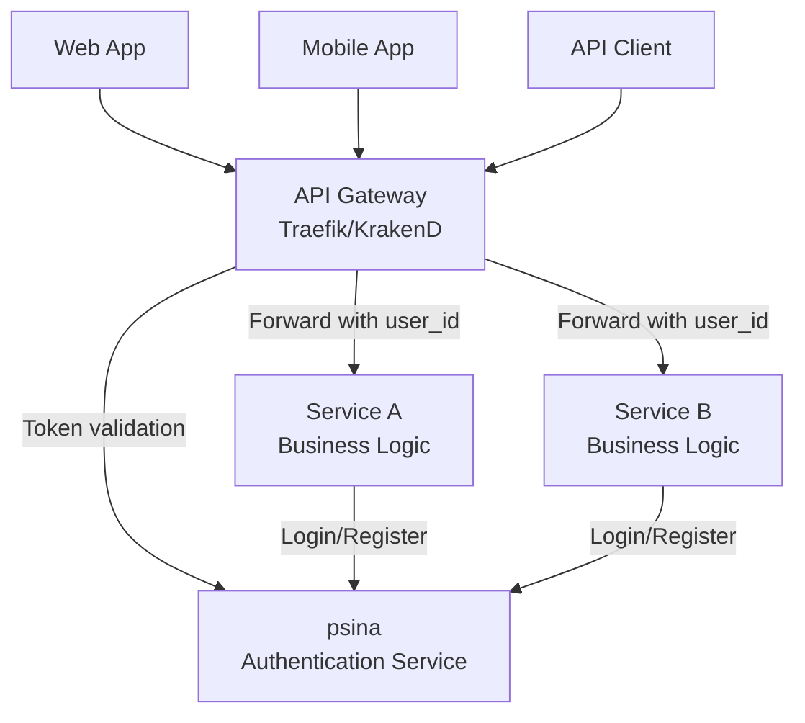
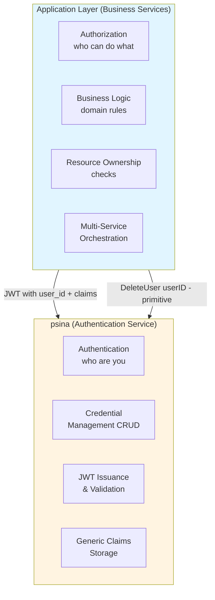

# psina — Architecture Documentation

## Overview

Modular authentication service for Go microservices. Embeddable as
library or deployable as standalone microservice.

Based on arc42 template + C4 model.

---

## 1. Introduction and Goals

### 1.1 Requirements

**Business Requirements:**

- Reusable authentication for Go microservices
- Embed in monolith or deploy as separate service
- Multiple auth providers (local, passkeys, Web3 wallets)
- Easy integration with API gateways (Traefik, KrakenD)
- Open source (MIT license)

**Functional Requirements:**

- User registration and login (username/password)
- JWT token issuance with refresh token flow
- JWKS endpoint for gateway validation
- WebAuthn/Passkeys support (v0.2)
- Ethereum wallet signature auth (v0.3)
- Traefik ForwardAuth integration

**Non-functional Requirements:**

- Token validation < 10ms (in-memory JWKS cache)
- Auth flow < 100ms
- Horizontal scalability (stateless)
- Single binary deployment

### 1.2 Quality Goals

| Priority | Goal              | Metric                              |
| -------- | ----------------- | ----------------------------------- |
| 1        | **Embeddability** | Import and use in 10 lines of code  |
| 2        | **Extensibility** | Add new provider in < 200 LOC       |
| 3        | **Security**      | OWASP compliance, Argon2id, RS256   |
| 4        | **Operability**   | Single binary, < 5 min setup        |

### 1.3 Stakeholders

| Role                | Expectations                      |
| ------------------- | --------------------------------- |
| Go developers       | Simple import, clear API          |
| Platform engineers  | Gateway compatibility, monitoring |
| Security engineers  | Audit logs, secure defaults       |

---

## 2. Constraints

### 2.1 Technical

- **Language**: Go 1.22+
- **Database**: PostgreSQL 14+ (primary), SQLite (dev/embedded)
- **Protocol**: Connect RPC (gRPC + HTTP/JSON on same port)
- **Container**: Docker, single binary

### 2.2 Standards Compliance

- OAuth 2.0 (RFC 6749)
- JWT (RFC 7519), JWK (RFC 7517)
- WebAuthn Level 2 (W3C)
- OWASP Authentication Cheat Sheet

---

## 3. Context and Scope

### 3.1 System Context (C1)



**Interactions:**

- Gateway → psina: Token validation (ForwardAuth or JWKS)
- Apps → psina: Login, register, refresh tokens
- Gateway → Services: Forward requests with X-User-Id header

### 3.2 Responsibility Boundary



**psina Responsibilities:**
- Authentication primitives (who are you?)
- Credential CRUD operations
- JWT issuance and validation
- Generic claims storage (no interpretation)
- **NO authorization logic**

**Application Responsibilities:**
- Authorization (who can do what?)
- Business logic and domain rules
- Resource ownership checks
- Multi-service orchestration (e.g., cleanup before user deletion)

**Example Authorization Flow:**
```go
// Application enforces authorization
func (app *Service) DeleteUser(ctx context.Context, targetUserID string) error {
    currentUserID := getUserID(ctx)
    
    // Authorization - application's responsibility
    if !app.canDeleteUser(currentUserID, targetUserID) {
        return ErrForbidden
    }
    
    // Business cleanup - application's responsibility
    app.cleanupUserData(targetUserID)
    
    // Authentication primitive - psina's responsibility
    return app.psinaClient.DeleteUser(ctx, targetUserID)
}
```

---

## 4. Solution Strategy

### 4.1 Architectural Patterns

- **Hexagonal Architecture**: Domain isolated from adapters
- **Plugin System**: Providers as pluggable modules
- **Dual Deployment**: Library (pkg/) or microservice (cmd/)
- **Stateless JWT**: No session storage required
- **Single Port**: gRPC + HTTP/JSON + gRPC-Web via Connect RPC

### 4.2 Technology Choices

| Aspect        | Choice          | Rationale                                |
| ------------- | --------------- | ---------------------------------------- |
| RPC           | Connect RPC     | gRPC + HTTP/JSON, same port, no proxy    |
| JWT signing   | RS256           | Asymmetric, gateways validate w/o secret |
| Password hash | Argon2id        | Current best practice                    |
| Protobuf      | buf (local)     | OpenAPI 3.1 via connect-openapi          |
| Migrations    | golang-migrate  | Standard, embedded support               |

### 4.3 Why Connect RPC

**gRPC-Gateway** requires a proxy layer:

```text
HTTP client ──► Gateway (port 8080) ──► gRPC server (port 50051)
```

**Connect RPC** serves everything on one port:

```text
HTTP/JSON ─┐
gRPC      ─┤──► Single server (port 8080)
gRPC-Web  ─┘
```

Benefits:

- curl-friendly: `curl -d '{...}' http://psina/auth.v1.AuthService/Login`
- Standard net/http middleware works
- OpenAPI 3.1 (grpc-gateway only has 2.0)

---
